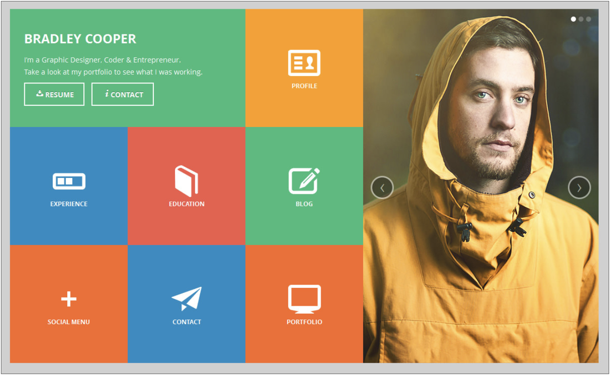
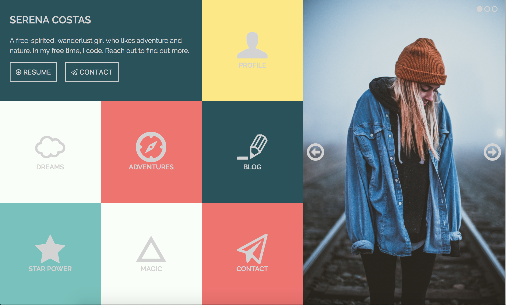

# Static Comp #1

For our first static comp, we had to recreate a given comp using HTML and CSS. We had to respect the integrity of the original comp and started working with Flexbox to create a responsive layout to fit all screen sizes. We were able to take creative liberties with the copy, images, icons, and color palette. 

## Original Comp

## My Comp

Since we were able to change the color scheme, I decided to go with a turquoise and red theme. I chose an artsy picture that had some burnt orange and blues in it so that it still had some of the same underlying tones as the color scheme I chose. I also went with Raleway, a sans-serif font that is clear to read and has an especially nice "w."

As far as the CSS goes, I used Flexbox to make the boxes stack properly when changing the screen width. I also used Flex within the boxes themselves to make sure that the icons stayed in the center and adapted to the layout. 

## Authors

* Amanda Tjan

## Acknowledgments

* Thank you to all my wonderful cohort-mates who helped me refine my layout during the long days and nights at Turing. 

